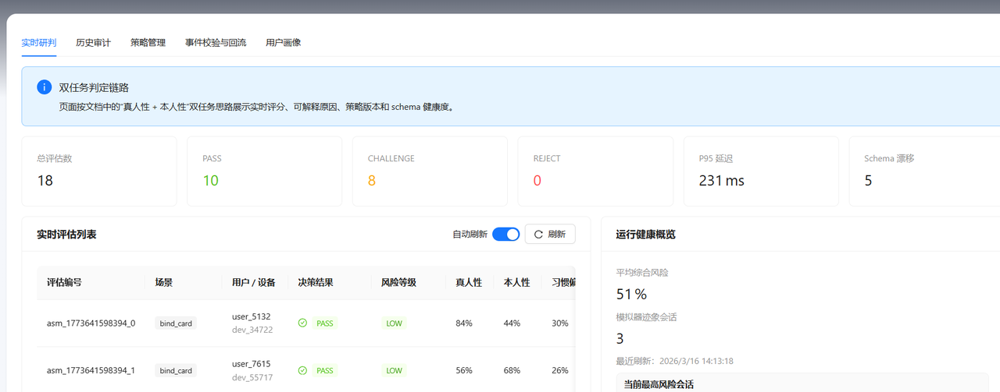
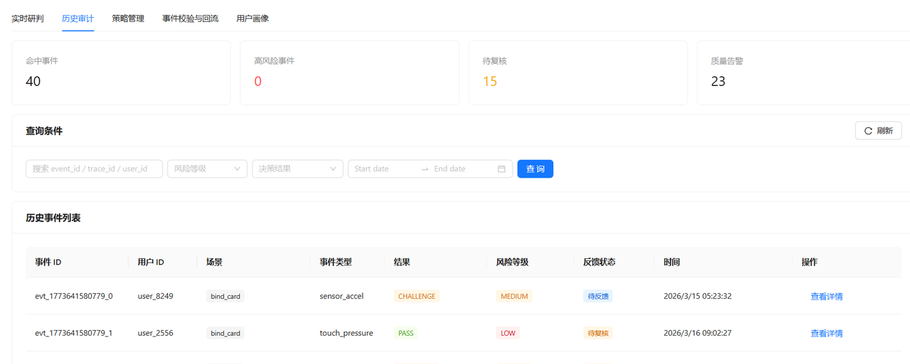
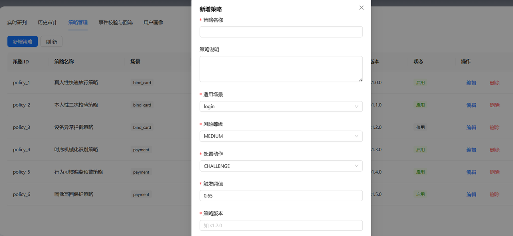
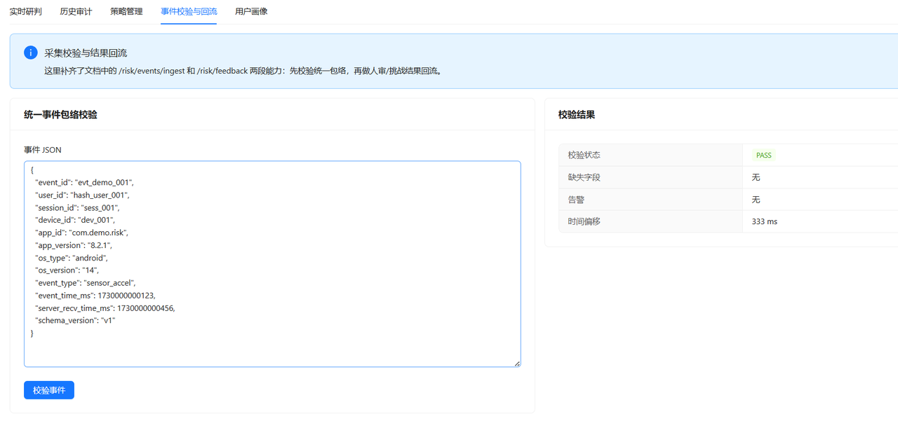
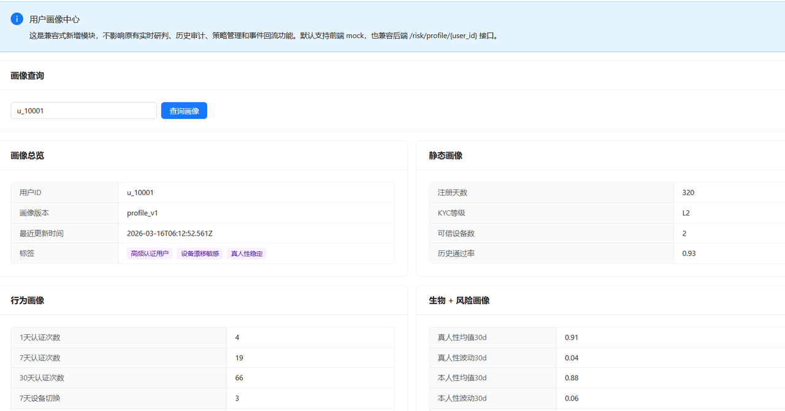

# 项目介绍

## 项目概述

本项目是一个基于 **生物探针识别与用户画像分析的实时风控系统
Demo**。系统通过采集用户在认证过程中的生物特征数据（如眨眼、面部动作、纹理一致性等），结合用户历史行为画像，对认证行为进行实时风险评估与决策。

系统模拟真实业务中的身份认证风控流程，包括：

-   事件接入与统一数据包络
-   实时风险评分
-   真人性与本人性检测
-   用户画像分析
-   风控策略引擎
-   风险解释与审计
-   历史记录查询与反馈回流

该项目主要用于 **风控系统架构演示、技术验证以及前后端联调示例**。

------------------------------------------------------------------------

# 系统架构

系统由 **前端风控平台 + 风控服务层** 组成，整体流程如下：

    用户行为
       │
       ▼
    事件接入 (Event Ingest)
       │
       ▼
    特征提取 (Bio Probe Feature)
       │
       ├── 真人性检测 (Liveness Detection)
       ├── 本人性检测 (Identity Matching)
       │
       ▼
    用户画像服务 (User Profile)
       │
       ▼
    风险策略引擎 (Policy Engine)
       │
       ▼
    风险决策
       │
       ├── PASS
       ├── REVIEW
       └── REJECT
       │
       ▼
    历史审计 / 反馈回流

系统通过 **实时行为特征 + 用户历史画像**
的方式综合评估风险，从而提升识别准确率。

------------------------------------------------------------------------

# 核心功能

## 1 实时风险评估

系统支持提交认证事件并进行实时风险评分。

评分主要包含三个指标：

-   **真人性评分（Liveness Score）**
-   **本人性评分（Identity Score）**
-   **综合风险评分（Risk Score）**

返回结果包括：

-   风险分数
-   风险等级
-   决策结果
-   命中规则
-   策略版本

------------------------------------------------------------------------

## 2 用户画像系统

系统引入用户画像用于分析用户长期行为模式。

用户画像主要包含四类信息：

### 基础画像

-   注册时长
-   实名等级
-   可信设备数量
-   历史认证成功率

### 行为画像

-   1天 / 7天 / 30天认证次数
-   设备切换次数
-   地域变化次数
-   活跃时间段

### 生物特征画像

-   真人性均值
-   本人性均值
-   生物特征波动范围
-   生物探针稳定度

### 风险画像

-   最近风险等级
-   风险变化趋势
-   高频命中规则

系统通过对比 **当前认证行为与历史画像基线**，识别异常行为。

------------------------------------------------------------------------

## 3 风控策略引擎

系统通过策略引擎进行风险决策。

风险评分由三部分组成：

    总风险分 =
        当前事件风险
      + 生物特征偏差风险
      + 用户画像行为风险

系统根据风险分数生成决策：

  风险等级   决策
---------- --------
  Low        PASS
  Medium     REVIEW
  High       REJECT

策略支持版本化管理，方便策略升级和回溯。

------------------------------------------------------------------------

## 4 风险解释机制

系统提供可解释的风控结果。

每次评分会返回：

-   命中规则
-   用户画像偏差
-   真人性变化
-   本人性变化
-   风险因子

例如：

    风险原因：
    DEVICE_SWITCH_ABNORMAL
    BIO_PATTERN_SHIFT

这样可以帮助风控人员快速定位风险来源。

------------------------------------------------------------------------

## 5 历史审计

系统支持查询历史风控记录，包括：

-   认证事件
-   风险评分
-   决策结果
-   命中规则
-   用户画像快照

历史数据可用于：

-   风控审计
-   模型优化
-   策略调整

------------------------------------------------------------------------

## 6 风险反馈回流

系统支持人工反馈风控结果。

反馈类型包括：

-   fraud（确认欺诈）
-   legit（确认正常）
-   false_positive（误杀）
-   false_negative（漏判）

反馈数据可用于优化风控策略和更新用户画像。

------------------------------------------------------------------------

# 系统特点

-   可解释风控：每次决策都提供风险原因
-   用户画像驱动：结合用户长期行为特征进行风险评估
-   模块化架构：特征服务、画像服务、策略引擎相互独立
-   实时风控能力：支持快速风险评估

------------------------------------------------------------------------

# 应用场景

该系统适用于多种身份认证和安全风控场景，例如：

-   金融账户登录验证
-   在线身份认证
-   远程开户
-   设备安全检测
-   防止账户盗用
-   反欺诈检测

------------------------------------------------------------------------

In the project directory, you can run:

##依赖安装
npm install

### 后端启动
启动backend目录的start_backend.bat

或者
pip install -r requirements.txt
uvicorn app.main:app --reload --port 8000

### `npm start`

Runs the app in the development mode.\
Open [http://localhost:3000](http://localhost:3000) to view it in your browser.

The page will reload when you make changes.\
You may also see any lint errors in the console.

### `npm test`

Launches the test runner in the interactive watch mode.\
See the section about [running tests](https://facebook.github.io/create-react-app/docs/running-tests) for more information.

### `npm run build`

Builds the app for production to the `build` folder.\
It correctly bundles React in production mode and optimizes the build for the best performance.

The build is minified and the filenames include the hashes.\
Your app is ready to be deployed!

See the section about [deployment](https://facebook.github.io/create-react-app/docs/deployment) for more information.

